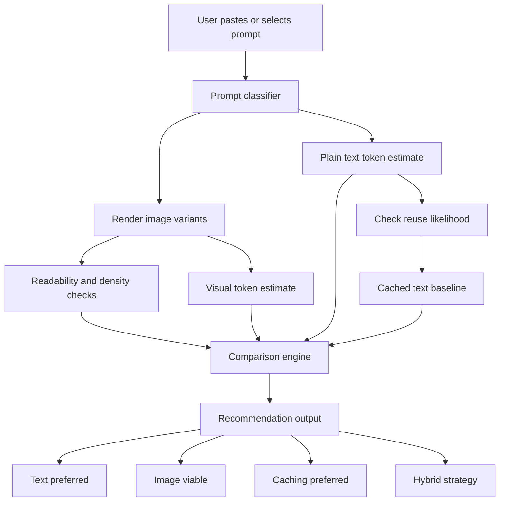

# Prompt Format Optimizer

## Concept Overview

Prompt Format Optimizer is a developer tool that helps users decide whether a task prompt should remain plain text, be converted into a low-resolution image, or be reused through caching. The core idea is not just token counting, but format selection: choosing the cheapest usable prompt format without undermining instruction fidelity, OCR quality, or agent performance.

The tool is built around a practical question emerging from multimodal workflows: if large prompts can be rendered as images and read by models such as Claude or other multimodal agents, can that reduce cost enough to justify the loss in textual precision? Existing vendor documentation suggests that image inputs are billed as visual tokens rather than text tokens, and that prompt caching is often a competing optimization path rather than an alternative afterthought.[cite:29][cite:38]

## Problem Statement

Developers currently optimize prompt cost in fragmented ways. Token calculators estimate usage, model docs explain image billing, and prompt engineering tools help rewrite prompts, but there is no common workflow that answers the operational question: **which prompt format is best for this task?**

This gap matters because a long prompt can be handled in at least three ways:

- Keep it as plain text for maximum instruction fidelity.
- Render it into an image to test whether multimodal input is cheaper.
- Keep it as text but rely on prompt caching when the prompt is reused frequently.[cite:29][cite:38]

Without a comparison layer, users may assume that converting text to an image automatically saves money. In reality, visual inputs still consume tokens, and small or dense text can become harder to read after resizing.[cite:29]

## Product Thesis

The product thesis is simple: **prompt optimization should be format-aware, model-aware, and task-aware**.

A useful system should answer four questions in one place:

1. How many tokens does the text version likely consume?
2. How many visual tokens would the image version likely consume at different resolutions?
3. How much readability or fidelity is lost when text is compressed into an image?
4. Is prompt caching a better optimization path than multimodal conversion for this prompt?[cite:29][cite:38]

This shifts the product from being a narrow converter into a broader decision engine for multimodal prompting.

## Product Vision

The long-term vision is a cross-platform prompt optimization layer for agentic workflows. Users working in editor environments, browser-based prompt tools, or API workflows should be able to paste or select a prompt and instantly receive a recommendation across text, image, and cached variants.

The strongest product framing is therefore not “text-to-image prompt converter,” but one of the following:

- Prompt Format Optimizer
- Multimodal Prompt Cost Comparator
- Text vs Image Prompt Benchmarker
- Prompt Compression Advisor

Among these, **Prompt Format Optimizer** is the clearest because it emphasizes decision support rather than raw conversion.

## Core User

The initial user is a technical builder using AI agents in coding or workflow contexts, especially those experimenting with long system prompts, repeated instruction blocks, or multimodal tasks.

Likely early adopters include:

- Developers using Claude-style or Cursor-style agent workflows.
- Prompt engineers optimizing recurring system prompts.
- Teams building internal tooling around multimodal APIs.
- Researchers and experimentation-heavy users benchmarking cost-quality tradeoffs.

## Core Value Proposition

The product offers a decision layer above token counting.

Instead of saying only “this image may cost X tokens,” it says:

- “Keep this as text.”
- “This prompt may be cheaper as a 384 px image, but fidelity risk is high.”
- “This prompt is reused often; prompt caching is the better optimization.”
- “Your prompt is layout-heavy, so image conversion may be reasonable.”

That recommendation engine is the actual moat.

## MVP Scope

The first prototype should stay narrow and prove the central hypothesis. It does not need full agent integration or perfect cost prediction.

### MVP features

- Paste or import a prompt.
- Estimate plain-text token usage.
- Render prompt variants into low-resolution image outputs, such as 256 px, 384 px, and 512 px.
- Estimate image-token cost using documented provider rules where available.[cite:29]
- Compare text, image, and cached-text options.[cite:38]
- Score readability risk and likely instruction fidelity.
- Output a recommendation label such as “Text preferred,” “Image viable,” or “Use caching.”

### MVP exclusions

- No automatic live billing integration in v0.1.
- No universal support for every model family.
- No attempt to optimize generated responses, only prompt inputs.
- No complex enterprise dashboard initially.

## Product Architecture

The product should be built in two layers.

### 1. Core package

The core package is the engine and should be built first. It should be reusable from CLI, API wrappers, notebooks, and extensions.

Suggested responsibilities:

- Prompt ingestion and parsing.
- Text token estimation hooks.
- Prompt-to-image rendering.
- Resolution preset generation.
- Readability and density checks.
- Comparison scoring.
- Recommendation output.

A TypeScript package is a strong first choice because it can later power both editor extensions and browser extensions with minimal duplication.[cite:39][cite:45]

### 2. Extension layer

The extension should come after the package and act as the adoption layer.

Suggested interfaces:

- VS Code or Cursor-style extension panel.
- Browser extension for selected text on the web.
- Lightweight web app later for broader testing.

VS Code-style webviews are already well-supported for custom tool interfaces, which makes editor integration a practical early distribution path.[cite:39][cite:45][cite:47]

## Why Package First

Building only an extension first would over-prioritize the interface over the underlying decision logic. The core differentiator is the comparison engine, not the shell.

A package-first approach creates:

- Reusable logic.
- Easier testing and benchmarking.
- Better maintainability.
- Future portability into extensions, APIs, and research notebooks.

The extension can then become the fastest route to user feedback without locking the product into one surface.

## Recommended Initial Stack

### Core

- Language: TypeScript.
- Runtime: Node.js.
- Rendering: Canvas or SVG-to-PNG pipeline.
- OCR/readability module: optional but highly useful for v0.1.
- Model rules: provider-specific token estimators driven by documented token logic where available.

### UI

- First interface: VS Code-style extension panel.
- Second interface: Chrome extension for general browser workflows.

This ordering matches the likely early-user environment more closely than starting with a Chrome-only tool.[cite:39][cite:43][cite:45]

## Comparison Meter Design

The product should not stop at raw token totals. It needs a comparison meter that converts technical metrics into a recommendation.

### Suggested meter dimensions

| Dimension | Meaning |
|---|---|
| Cost score | Estimated cost difference across prompt formats |
| Fidelity score | Risk of losing exact instruction meaning |
| Readability score | Likelihood that rendered text remains legible |
| Reusability score | Whether caching is superior for recurring prompts |
| Suitability score | Whether the prompt is text-heavy, layout-heavy, or visual-heavy |

### Example recommendation outputs

- **Text wins**: Exact wording matters and image conversion has high fidelity risk.
- **Image viable**: Layout-heavy prompt, low readability loss, possible token savings.
- **Caching wins**: Prompt is large and repeated; reuse economics outweigh image conversion.
- **Hybrid possible**: Keep instructions as text, move structured annexes to image blocks.

## Roadmap

## Phase 0: Validation

Goal: confirm that the product solves a real workflow pain point rather than an interesting but niche curiosity.

Tasks:

- Interview developers using long prompts in Claude-style or Cursor-style environments.
- Collect 20 to 50 real prompts across coding, research, and operations workflows.
- Benchmark text versus image versus cached-text outcomes manually.
- Identify recurring prompt categories where the format tradeoff is meaningful.

Outputs:

- Prompt dataset.
- Use-case taxonomy.
- Early benchmark notes.

## Phase 1: Prototype Engine

Goal: prove the comparison logic.

Tasks:

- Build prompt ingestion.
- Add text token estimation.
- Add image rendering at preset resolutions.
- Implement a simple comparison meter.
- Generate recommendation labels.
- Export results in JSON and human-readable CLI output.

Outputs:

- Local package prototype.
- Baseline comparison engine.
- Early test corpus.

## Phase 2: Editor Prototype

Goal: test adoption in real workflows.

Tasks:

- Build a VS Code or Cursor-style extension.
- Allow users to select prompt text and open comparison results in a panel.
- Add side-by-side display for text, image variants, and recommendation outputs.
- Add exportable benchmark reports.

Outputs:

- Installable extension.
- User testing loop.
- Interaction feedback.

## Phase 3: Model-Aware Expansion

Goal: improve recommendation credibility.

Tasks:

- Support provider-specific estimation profiles.
- Add prompt caching comparison as a first-class baseline.[cite:38]
- Improve readability and OCR-risk scoring.
- Track prompt category differences, such as code-heavy versus layout-heavy prompts.

Outputs:

- Better model-aware scoring.
- More reliable recommendation engine.
- Sharper product differentiation.

## Phase 4: Productization

Goal: move from prototype to product.

Tasks:

- Add team workspaces or saved prompt experiments.
- Build a web dashboard.
- Add shareable benchmark links.
- Build browser extension support.
- Create public-facing benchmark examples and documentation.

Outputs:

- Public beta.
- Onboarding flow.
- Clear pricing strategy.

## Pitch Narrative

### One-line pitch

**Prompt Format Optimizer helps developers find the cheapest usable way to send prompts to multimodal AI systems without guessing.**

### Short pitch

Developers already know how to count text tokens, but multimodal systems create a new optimization problem: should a prompt stay as text, be converted into an image, or be reused through caching? Prompt Format Optimizer compares those options, estimates cost, measures readability risk, and recommends the best format for the task.

### Expanded pitch

As multimodal models become standard, prompt optimization is no longer just about shorter wording. Developers can now send long instructions as text, compress them into images, or rely on prompt caching for repeated context. Each path changes the economics and the failure modes. Prompt Format Optimizer is the missing decision layer that benchmarks these options and tells users which format is worth using for a given task.

## Investor/Stakeholder Angle

This idea sits at the intersection of three active trends:

- Rising use of multimodal models.
- Growing concern about token spend and inference cost.
- Wider adoption of agentic coding and workflow tools.

The product is attractive because it can begin as a narrow developer utility but expand into a broader optimization layer for agent infrastructure.

## Positioning

### What it is

- A prompt optimization decision engine.
- A benchmarking layer for multimodal input formats.
- A developer productivity and cost-control tool.

### What it is not

- Not just a token calculator.
- Not just a prompt engineering assistant.
- Not merely a text-to-image converter.
- Not an OCR tool sold as a prompt product.

## Differentiation

### Existing tools do this well

- Token calculators estimate usage.
- Model docs explain image billing rules.[cite:29]
- Prompt tools help rewrite instructions.
- IDE extensions help users call models quickly.[cite:39][cite:45]

### This product adds something missing

- Format comparison.
- Readability risk scoring.
- Caching as a baseline strategy.[cite:38]
- A direct recommendation layer for real task contexts.

## Risks and Constraints

Several risks need to be addressed early.

### Technical risks

- Token accounting differs by provider and can change over time.
- Image readability depends heavily on font size, density, and rendering quality.
- Cost savings may be smaller than users expect.
- Some prompts fail badly when wording is no longer exact.

### Product risks

- The workflow may be too niche unless positioned around real developer pain.
- Users may prefer caching over image conversion in many cases.[cite:38]
- Vendor-side tools may eventually absorb some of this functionality.

## Mitigation Strategy

- Keep the product model-aware and documentation-driven.
- Position image conversion as one option, not the entire product.
- Make caching comparison central from the start.[cite:38]
- Focus on recommendation quality rather than novelty alone.

## Initial User Flow

The first user flow should be simple and testable.

1. User pastes or selects a prompt.
2. Tool classifies the prompt shape, such as prose-heavy, code-heavy, or layout-heavy.
3. Tool measures the plain-text token estimate.
4. Tool renders image variants at preset resolutions.
5. Tool estimates visual token cost and readability risk.
6. Tool compares image results with cached-text baseline if reuse is likely.[cite:38]
7. Tool outputs recommendation, tradeoffs, and best format.

## Initial Flow Diagram

## v0.1 Success Metrics

The first version should be judged by learning, not just feature count.

### Core metrics

- Number of real prompts benchmarked.
- Percentage of cases where recommendations align with human judgment.
- Time to produce a recommendation.
- Number of repeated prompts where caching is correctly identified as superior.
- User retention among developers testing real agent workflows.

## Suggested Next Deliverables

After this document, the next practical outputs should be:

- A product requirements document for v0.1.
- A technical module architecture.
- A sample UI wireframe for the editor extension.
- A benchmark dataset template.
- A landing-page style narrative for demo or fundraising.

## Closing View

The strongest form of this idea is not “convert prompts into images.” It is **help users choose the right prompt format under cost, fidelity, and reuse constraints**. That framing is broader, more defensible, and better aligned with where multimodal agent tooling is going.
