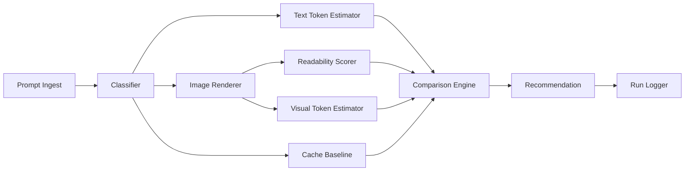

# TokenTrail

> **Product sentence:** TokenTrail is a rules-first prompt format optimizer today, with ML as a later ranking layer once enough benchmark data exists.

## What we're building

A decision engine that answers: *should this prompt stay as text, become an image, or use caching?*

Not a converter. Not just a token calculator. A **format comparison + recommendation** layer.

## Build strategy (agreed)

| Stage | Approach | Why |
| ----- | -------- | --- |
| [[V0 - Rules Engine]] | Rule-based coding | Fastest to validate; easiest to explain |
| [[V1 - Hybrid Scoring]] | Hand-tuned weighted scores | Cost, readability, fidelity, reusability |
| [[V2 - ML Ranking]] | ML-assisted ranking | Only after enough logged comparisons |

## Start here

1. Read [[Build From Scratch]]
2. Implement [[Comparison Engine]] first (core moat)
3. Layer [[Recommendation Rules]] on top
4. Wire [[Run Logger]] from day one
5. Defer [[V2 - ML Ranking]] until [[Benchmark Dataset]] has 200+ labeled runs

## Module map



## Docs index

- [[Vision & Thesis]] — problem, positioning, differentiation
- [[MVP Scope]] — v0.1 in / out
- [[Technical Architecture]] — package layout, interfaces
- [[Comparison Engine]] — scoring dimensions
- [[Recommendation Rules]] — V0 rule table
- [[Track Record]] — step-by-step progress log
- [[Step 4.1 CLI Path Resolution]]
- [[Step 4.2 Agent Request Analyzer]]
- [[Step 4.3 Proxy Skeleton]]
- [[Surfaces Architecture]] — package / CLI / agent CLIs / extension
- [[Context Token Savings]] — agent context imaging strategy
- [[Provider Token Rules]] — Claude patch math
- [[Benchmark Dataset]] — corpus + labeling template
- [[Roadmap Phases]] — Phase 0–4 from roadmap doc
- [[Risks & Mitigations]]
- [[Success Metrics]]

## Source doc

Full narrative roadmap: `../docs/prompt-format-optimizer-roadmap.md`

## Status

**V0.5** — multi-agent proxy (Claude CLI, Cursor CLI, Anthropic-compatible).

```bash
pnpm proxy:dev
ANTHROPIC_BASE_URL=http://127.0.0.1:47821 claude
```

Guides: [[Step 5.1 Agent CLI Proxy]] · `docs/agent-cli-setup.md`

## Open decisions

- [x] Image render: `sharp` + SVG
- [ ] Primary tokenizer for V0: `tiktoken` vs provider SDK hooks
- [ ] First provider profile: Claude vs OpenAI
- [ ] Proxy vs MCP first for agent CLI integration
